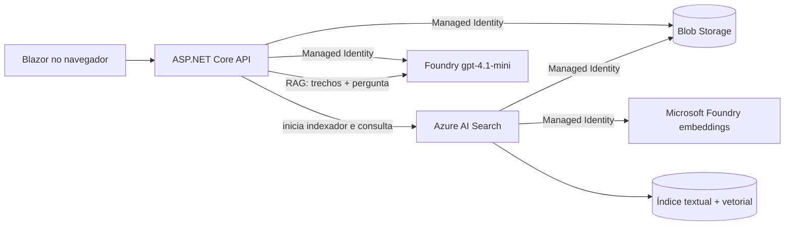

# Azure Blob Search MVP

Aplicação **Blazor + .NET 10** que recebe arquivos PDF, DOCX e TXT, armazena-os no Azure Blob Storage e oferece busca híbrida e conversa RAG sobre o conteúdo. A recuperação combina BM25 e vetores no Azure AI Search; o `gpt-4.1-mini` compõe respostas estritamente fundamentadas com citações.

## Arquitetura



O indexador extrai o texto, divide cada documento em trechos sobrepostos, gera um
embedding para cada trecho e grava texto, vetor e metadados no índice. Durante a
pesquisa, BM25 e busca vetorial rodam em paralelo e o Azure AI Search combina os
rankings com Reciprocal Rank Fusion (RRF). A API não precisa baixar PDFs nem
executar bibliotecas locais de parsing.

## Interface Blazor

A interface oferece dois modos complementares:

1. seleção e upload de PDF, DOCX ou TXT;
2. upload em lote de até 100 documentos dentro de um ZIP;
3. acompanhamento automático até os documentos serem indexados;
4. pesquisa híbrida por palavras e significado, com score, metadados e trechos destacados;
5. conversa RAG com memória durante a aba, streaming e fontes;
6. layout responsivo para desktop e celular.

O projeto usa **Blazor Web App com Interactive Server**. Os componentes rodam no servidor por uma conexão SignalR e reutilizam diretamente os serviços da camada de aplicação. Isso mantém a UI e a API no mesmo deploy, sem CORS e sem um segundo Container App.

## Recursos criados

O arquivo `infra/main.bicep` cria:

- Storage Account e container privado `documents`;
- container privado `batch-status` para persistir o progresso dos lotes;
- Azure AI Search Basic com autenticação exclusiva por Microsoft Entra ID;
- conexão com deployments existentes `text-embedding-3-small` e `gpt-4.1-mini` no Microsoft Foundry;
- Azure Container Registry;
- Azure Container Apps Environment e Container App;
- Log Analytics Workspace;
- identidades gerenciadas e todos os role assignments necessários.

Nenhuma chave de Storage, Search ou Azure OpenAI é armazenada pela aplicação.

## Pré-requisitos

- [.NET SDK 10](https://dotnet.microsoft.com/download/dotnet/10.0);
- uma assinatura Azure;
- [Azure CLI](https://learn.microsoft.com/cli/azure/install-azure-cli-windows);
- extensão Container Apps do Azure CLI;
- permissão `Owner` ou `User Access Administrator` + `Contributor` na assinatura/resource group, pois o Bicep cria role assignments.
- um recurso Microsoft Foundry no mesmo resource group, com os deployments
  `text-embedding-3-small` e `gpt-4.1-mini` implantados.

O Docker local não é necessário: o .NET 10 constrói a imagem OCI e a envia diretamente ao Azure Container Registry.

## 1. Instalar e autenticar o Azure CLI

No PowerShell:

```powershell
winget install --exact --id Microsoft.AzureCLI
az login
az account list --output table
az extension add --name containerapp --upgrade
az provider register --namespace Microsoft.Search
az provider register --namespace Microsoft.Storage
az provider register --namespace Microsoft.App
az provider register --namespace Microsoft.ContainerRegistry
az provider register --namespace Microsoft.OperationalInsights
az provider register --namespace Microsoft.CognitiveServices
```

Copie o `SubscriptionId` mostrado por `az account list`.

## 2. Preparar os modelos no Foundry

No [portal do Microsoft Foundry](https://ai.azure.com):

1. crie ou abra um recurso/projeto no mesmo resource group da aplicação;
2. em **Descobrir > Modelos**, escolha `text-embedding-3-small`;
3. clique em **Implantar** e use também `text-embedding-3-small` como nome do
   deployment;
4. para o MVP, selecione `GlobalStandard`, capacidade mínima disponível e a
   política `OnceNewDefaultVersionAvailable`;
5. repita para `gpt-4.1-mini`, versão `2025-04-14`, usando esse mesmo nome de deployment;
6. aguarde os dois estados **Succeeded**.

O script recebe apenas o nome do recurso. A chave exibida pelo Foundry não é
necessária: o Azure AI Search chama o modelo com sua identidade gerenciada e a
role `Cognitive Services OpenAI User`.

## 3. Criar e publicar tudo

A partir da raiz do repositório:

```powershell
.\scripts\deploy.ps1 `
  -SubscriptionId "00000000-0000-0000-0000-000000000000" `
  -ResourceGroup "rg-blob-search-mvp" `
  -Location "brazilsouth" `
  -NamePrefix "minhabusca" `
  -EmbeddingAccountName "nome-do-recurso-foundry"
```

O script:

1. cria o resource group;
2. valida os deployments de embeddings e chat existentes no Microsoft Foundry;
3. conecta o Azure AI Search e a Container App aos modelos por identidade gerenciada;
4. constrói a imagem OCI com o .NET 10 e a envia ao Azure Container Registry;
5. publica a imagem na Container App;
6. mostra a URL HTTPS da API e do OpenAPI.

`NamePrefix` deve ter de 3 a 12 caracteres. Os nomes globalmente únicos de Storage, Search e ACR recebem um sufixo determinístico.

> O Azure AI Search Basic e o Log Analytics geram cobrança contínua. O Azure
> O Foundry cobra pelos tokens usados para embeddings e respostas. Para encerrar o MVP,
> exclua somente o resource group criado:
> `az group delete --name rg-blob-search-mvp`.

### Se a Azure retornar `715-123420`

Esse código indica um bloqueio de proteção contra fraude no nível da assinatura.
Não é erro do Bicep, falta de quota, região ou RBAC. Não repita deployments nem
recrie os recursos. Abra uma solicitação em **Portal Azure > Ajuda + suporte >
Criar uma solicitação de suporte**, escolha um problema de assinatura/cobrança se
o fluxo técnico não estiver disponível e peça encaminhamento para revisão do
time **Real-Time Fraud Protection (RTFP)**.

Inclua no chamado:

- código `715-123420`;
- horário UTC de uma tentativa;
- região e modelo;
- ID do recurso Azure OpenAI afetado;
- confirmação de que a assinatura está ativa e possui quota do modelo.

Depois que a Microsoft confirmar a liberação, crie o deployment no Foundry e
execute `scripts/deploy.ps1` novamente. Nenhuma alteração no código é necessária.

## 4. O que cada identidade pode fazer

| Identidade | Escopo | Role |
|---|---|---|
| Container App | container Blob | Storage Blob Data Contributor |
| Container App | Azure AI Search | Search Service Contributor |
| Container App | Azure AI Search | Search Index Data Contributor |
| Container App | Azure AI Search | Search Index Data Reader |
| Container App | ACR | AcrPull |
| Container App | Microsoft Foundry | Cognitive Services OpenAI User |
| Azure AI Search | Storage Account | Storage Blob Data Reader |
| Azure AI Search | Azure OpenAI | Cognitive Services OpenAI User |

Na primeira inicialização, a API cria ou atualiza de forma idempotente o índice
vetorial, data source, skillset e indexador. O indexador também roda a cada cinco
minutos.

## Executar localmente

Depois de implantar os recursos, descubra os nomes:

```powershell
az resource list --resource-group rg-blob-search-mvp --output table
```

Sua identidade local também precisa das mesmas permissões de dados usadas pela API. Para um MVP, atribua-as no portal em **Controle de acesso (IAM) > Adicionar atribuição de função**, no Storage e no Search, para o usuário com que você executou `az login`.

Configure o projeto sem salvar segredos no Git:

```powershell
.\scripts\configure-local.ps1 `
  -StorageAccountName "nome-do-storage" `
  -StorageResourceId "/subscriptions/.../resourceGroups/.../providers/Microsoft.Storage/storageAccounts/..." `
  -SearchServiceName "nome-do-search" `
  -EmbeddingAccountName "nome-do-recurso-foundry"

dotnet run --project .\src\AzureBlobSearch.Api
```

A aplicação usa `DefaultAzureCredential`. Localmente, ela aproveita o login do Azure CLI ou do Visual Studio; na Container App, usa a identidade gerenciada configurada pelo Bicep.

## Usar a API

A interface está disponível na raiz da URL publicada. Os endpoints abaixo continuam acessíveis para integrações e testes automatizados.

### Upload

```powershell
curl.exe -X POST "https://SUA-API/api/documents" `
  -F "file=@C:\documentos\contrato.pdf"
```

Resposta:

```json
{
  "documentId": "6fcfb3157454454981b05db08cb9a6fd",
  "fileName": "contrato.pdf",
  "statusUrl": "/api/documents/6fcfb3157454454981b05db08cb9a6fd/status"
}
```

O upload responde `202 Accepted`. A indexação é assíncrona.

### Status

```powershell
curl.exe "https://SUA-API/api/documents/6fcfb3157454454981b05db08cb9a6fd/status"
```

O estado será `pending`, `indexed` ou `failed`.

### Pesquisa

```powershell
curl.exe "https://SUA-API/api/search?q=cláusula&page=1&pageSize=20"
```

Os resultados incluem score, highlights e metadados do arquivo. A consulta combina
o analisador textual `pt-BR` com o vetor gerado para a pergunta. Resultados de
vários trechos do mesmo documento são consolidados em um único arquivo.

Para exigir um assunto e dar foco a uma intenção, use a forma:

```powershell
curl.exe "https://SUA-API/api/search?q=folha%20de%20pagamento%20com%20foco%20em%20ajustes"
```

Nesse caso, o componente textual procura `"folha de pagamento" AND ajustes`,
enquanto o vetor usa a pergunta completa para reconhecer termos relacionados.
Resultados apenas vagamente relacionados são removidos e os trechos com maior
densidade de correspondências aparecem primeiro.

### Conversa RAG

```powershell
$body = @{
  message = "O que mudou na release 1.69.1?"
  history = @()
} | ConvertTo-Json

Invoke-RestMethod `
  -Method Post `
  -Uri "https://SUA-API/api/chat" `
  -ContentType "application/json" `
  -Body $body
```

O endpoint recupera até cinco trechos, gera uma resposta com citações `[1]`,
`[2]` e devolve as fontes. A página `/chat` oferece streaming e mantém as últimas
quatro interações enquanto a aba estiver aberta. Perguntas sem evidência nos
arquivos são recusadas explicitamente.

### Upload em lote

```powershell
curl.exe -X POST "https://SUA-API/api/batches" `
  -F "file=@C:\documentos\pacote.zip;type=application/zip"
```

O ZIP pode ter até 100 MB e conter no máximo 100 documentos, totalizando até
250 MB depois da descompactação. Cada documento mantém o limite individual de
25 MB. ZIPs aninhados, extensões diferentes de PDF, DOCX e TXT e entradas com
taxa de compressão suspeita são rejeitados.

Consulte o progresso usando o `statusUrl` retornado:

```powershell
curl.exe "https://SUA-API/api/batches/ID-DO-LOTE/status"
```

## Validar o projeto

```powershell
.\scripts\validate.ps1
```

O script sempre executa restore, build e testes. Se Azure CLI e Docker estiverem presentes, também valida o Bicep e constrói a imagem.

## Configuração

Variáveis de ambiente usam a convenção do ASP.NET Core:

| Variável | Exemplo |
|---|---|
| `Azure__StorageAccountUri` | `https://conta.blob.core.windows.net` |
| `Azure__StorageResourceId` | `/subscriptions/.../storageAccounts/conta` |
| `Azure__SearchEndpoint` | `https://servico.search.windows.net` |
| `Azure__ContainerName` | `documents` |
| `Azure__BatchContainerName` | `batch-status` |
| `Azure__IndexName` | `document-chunks-index` |
| `Azure__IndexerName` | `documents-vector-indexer` |
| `Azure__SkillsetName` | `documents-vector-skillset` |
| `Azure__OpenAIEndpoint` | `https://recurso.services.ai.azure.com` |
| `Azure__EmbeddingDeploymentName` | `text-embedding-3-small` |
| `Azure__ChatDeploymentName` | `gpt-4.1-mini` |
| `Azure__EmbeddingModelName` | `text-embedding-3-small` |
| `Azure__EmbeddingDimensions` | `1536` |
| `Azure__MaximumChatOutputTokens` | `600` |
| `Azure__MaximumUploadBytes` | `26214400` |
| `Azure__ManagedIdentityClientId` | client ID da identidade atribuída pelo usuário |

## Limitações intencionais do MVP

- busca híbrida sem Semantic Ranker;
- conversa mantida apenas na memória da aba, sem persistência;
- API pública sem autenticação de usuário;
- limite padrão de 25 MB por arquivo;
- limite de 100 arquivos por ZIP, 100 MB compactado e 250 MB descompactado;
- PDF, DOCX e TXT;
- endpoints para upload, status e pesquisa, sem exclusão ou download.

Antes de produção, adicione Microsoft Entra ID na API, rede privada, políticas de retenção, antivírus para uploads, telemetria/alertas e testes de carga.

## Licença

[MIT](LICENSE)
