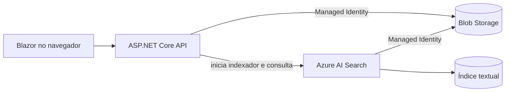

# Azure Blob Search MVP

Aplicação **Blazor + .NET 10** que recebe arquivos PDF, DOCX e TXT, armazena-os no Azure Blob Storage e permite pesquisar o conteúdo extraído pelo Azure AI Search. Inclui interface web responsiva e API HTTP documentada com OpenAPI.

## Arquitetura



O indexador do Azure AI Search extrai o texto dos documentos. A API não precisa baixar PDFs nem executar bibliotecas locais de parsing.

## Interface Blazor

A página inicial oferece o fluxo completo do MVP:

1. seleção e upload de PDF, DOCX ou TXT;
2. acompanhamento automático até o documento ser indexado;
3. pesquisa textual com score, metadados e trechos destacados;
4. layout responsivo para desktop e celular.

O projeto usa **Blazor Web App com Interactive Server**. Os componentes rodam no servidor por uma conexão SignalR e reutilizam diretamente os serviços da camada de aplicação. Isso mantém a UI e a API no mesmo deploy, sem CORS e sem um segundo Container App.

## Recursos criados

O arquivo `infra/main.bicep` cria:

- Storage Account e container privado `documents`;
- Azure AI Search Basic com autenticação exclusiva por Microsoft Entra ID;
- Azure Container Registry;
- Azure Container Apps Environment e Container App;
- Log Analytics Workspace;
- identidades gerenciadas e todos os role assignments necessários.

Nenhuma chave de Storage ou Search é armazenada pela aplicação.

## Pré-requisitos

- [.NET SDK 10](https://dotnet.microsoft.com/download/dotnet/10.0);
- uma assinatura Azure;
- [Azure CLI](https://learn.microsoft.com/cli/azure/install-azure-cli-windows);
- extensão Container Apps do Azure CLI;
- permissão `Owner` ou `User Access Administrator` + `Contributor` na assinatura/resource group, pois o Bicep cria role assignments.

O Docker local não é necessário: o .NET 10 constrói a imagem OCI e a envia diretamente ao Azure Container Registry.

## 1. Instalar e autenticar o Azure CLI

No PowerShell:

```powershell
winget install --exact --id Microsoft.AzureCLI
az login
az account list --output table
az extension add --name containerapp --upgrade
az provider register --namespace Microsoft.Search
az provider register --namespace Microsoft.Storage
az provider register --namespace Microsoft.App
az provider register --namespace Microsoft.ContainerRegistry
az provider register --namespace Microsoft.OperationalInsights
```

Copie o `SubscriptionId` mostrado por `az account list`.

## 2. Criar e publicar tudo

A partir da raiz do repositório:

```powershell
.\scripts\deploy.ps1 `
  -SubscriptionId "00000000-0000-0000-0000-000000000000" `
  -ResourceGroup "rg-blob-search-mvp" `
  -Location "brazilsouth" `
  -NamePrefix "minhabusca"
```

O script:

1. cria o resource group;
2. implanta o Bicep;
3. constrói a imagem OCI com o .NET 10 e a envia ao Azure Container Registry;
4. publica a imagem na Container App;
5. mostra a URL HTTPS da API e do OpenAPI.

`NamePrefix` deve ter de 3 a 12 caracteres. Os nomes globalmente únicos de Storage, Search e ACR recebem um sufixo determinístico.

> O Azure AI Search Basic e o Log Analytics geram cobrança. Para encerrar o MVP, exclua somente o resource group criado: `az group delete --name rg-blob-search-mvp`.

## 3. O que cada identidade pode fazer

| Identidade | Escopo | Role |
|---|---|---|
| Container App | container Blob | Storage Blob Data Contributor |
| Container App | Azure AI Search | Search Service Contributor |
| Container App | Azure AI Search | Search Index Data Contributor |
| Container App | Azure AI Search | Search Index Data Reader |
| Container App | ACR | AcrPull |
| Azure AI Search | Storage Account | Storage Blob Data Reader |

Na primeira inicialização, a API cria ou atualiza de forma idempotente o índice, data source e indexador. O indexador também roda a cada cinco minutos.

## Executar localmente

Depois de implantar os recursos, descubra os nomes:

```powershell
az resource list --resource-group rg-blob-search-mvp --output table
```

Sua identidade local também precisa das mesmas permissões de dados usadas pela API. Para um MVP, atribua-as no portal em **Controle de acesso (IAM) > Adicionar atribuição de função**, no Storage e no Search, para o usuário com que você executou `az login`.

Configure o projeto sem salvar segredos no Git:

```powershell
.\scripts\configure-local.ps1 `
  -StorageAccountName "nome-do-storage" `
  -StorageResourceId "/subscriptions/.../resourceGroups/.../providers/Microsoft.Storage/storageAccounts/..." `
  -SearchServiceName "nome-do-search"

dotnet run --project .\src\AzureBlobSearch.Api
```

A aplicação usa `DefaultAzureCredential`. Localmente, ela aproveita o login do Azure CLI ou do Visual Studio; na Container App, usa a identidade gerenciada configurada pelo Bicep.

## Usar a API

A interface está disponível na raiz da URL publicada. Os endpoints abaixo continuam acessíveis para integrações e testes automatizados.

### Upload

```powershell
curl.exe -X POST "https://SUA-API/api/documents" `
  -F "file=@C:\documentos\contrato.pdf"
```

Resposta:

```json
{
  "documentId": "6fcfb3157454454981b05db08cb9a6fd",
  "fileName": "contrato.pdf",
  "statusUrl": "/api/documents/6fcfb3157454454981b05db08cb9a6fd/status"
}
```

O upload responde `202 Accepted`. A indexação é assíncrona.

### Status

```powershell
curl.exe "https://SUA-API/api/documents/6fcfb3157454454981b05db08cb9a6fd/status"
```

O estado será `pending`, `indexed` ou `failed`.

### Pesquisa

```powershell
curl.exe "https://SUA-API/api/search?q=cláusula&page=1&pageSize=20"
```

Os resultados incluem score, highlights e metadados do arquivo. O analisador do campo `content` é `pt-BR`.

## Validar o projeto

```powershell
.\scripts\validate.ps1
```

O script sempre executa restore, build e testes. Se Azure CLI e Docker estiverem presentes, também valida o Bicep e constrói a imagem.

## Configuração

Variáveis de ambiente usam a convenção do ASP.NET Core:

| Variável | Exemplo |
|---|---|
| `Azure__StorageAccountUri` | `https://conta.blob.core.windows.net` |
| `Azure__StorageResourceId` | `/subscriptions/.../storageAccounts/conta` |
| `Azure__SearchEndpoint` | `https://servico.search.windows.net` |
| `Azure__ContainerName` | `documents` |
| `Azure__IndexName` | `documents-index` |
| `Azure__IndexerName` | `documents-blob-indexer` |
| `Azure__MaximumUploadBytes` | `26214400` |
| `Azure__ManagedIdentityClientId` | client ID da identidade atribuída pelo usuário |

## Limitações intencionais do MVP

- busca textual, sem embeddings ou Azure OpenAI;
- API pública sem autenticação de usuário;
- limite padrão de 25 MB por arquivo;
- PDF, DOCX e TXT;
- endpoints para upload, status e pesquisa, sem exclusão ou download.

Antes de produção, adicione Microsoft Entra ID na API, rede privada, políticas de retenção, antivírus para uploads, telemetria/alertas e testes de carga.

## Licença

[MIT](LICENSE)
